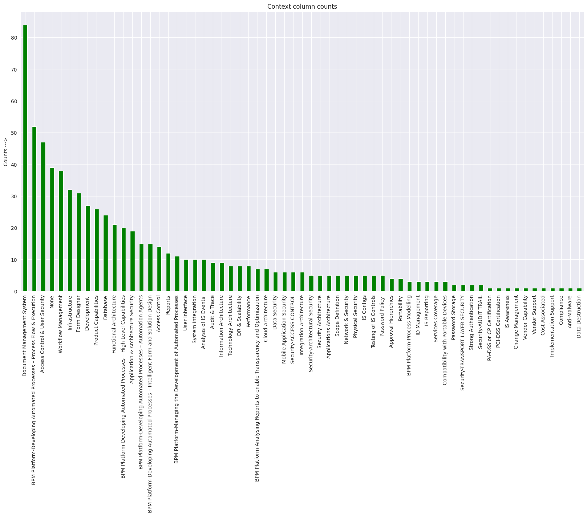
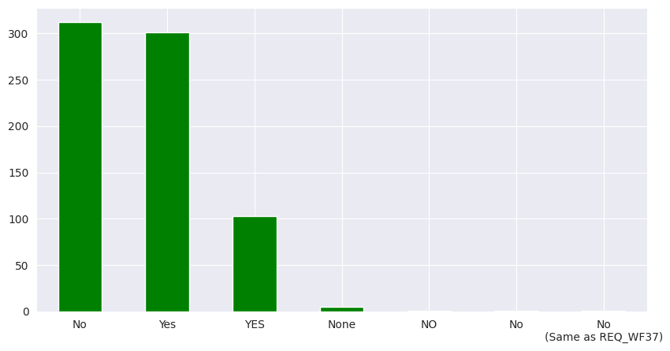
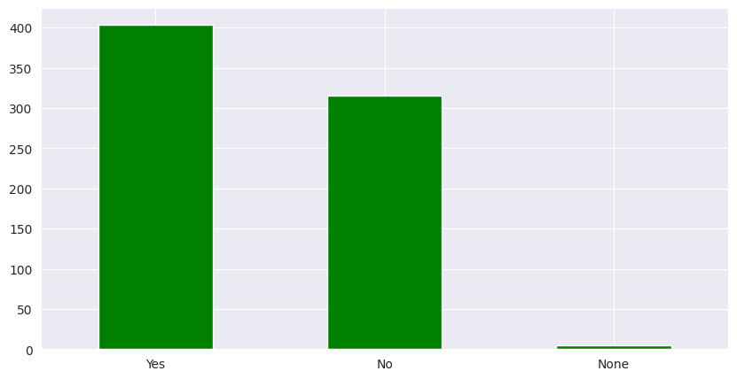

- [Post Training Quantization](#post-training-quantization)
- [path to training data](#path-to-training-data)
- [Dataset Distribution](#dataset-distribution)


# Post Training Quantization


```bash

python post_training_quantization.py

```


# path to training data

```bash
https://drive.google.com/file/d/1675J0gAHFfBkrQTaETxWnYM1UZnOE6w7/view?usp=share_link
```


# Dataset Distribution

Context column distribution in original dataset:




Decision column distribution original:




Decision column distribution after pre-processing:




